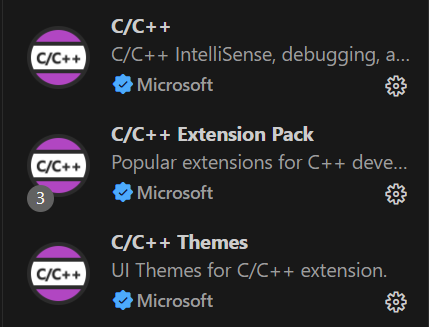

# 环境搭建

确保电脑拥有C/C++环境

**C++下载**


**vscode 扩展**



## Rust 安装工具

如果你还未安装 Rust 编程语言的开发工具链，你可以在 [Rust 官方网站](https://www.rust-lang.org/tools/install) 上找到安装说明和工具链下载链接。

点击下面的链接即可前往 Rust 官方网站下载页面：

[点击此处下载 Rust 工具链](https://www.rust-lang.org/tools/install)


## Tauri下载

### 详见[文档](https://tauri.app/zh-cn/v1/guides/getting-started/setup/html-css-js)

```sh
Cargo下载: 
    cargo install tauri-cli
npm下载: 
    npm install --save-dev @tauri-apps/cli
```
